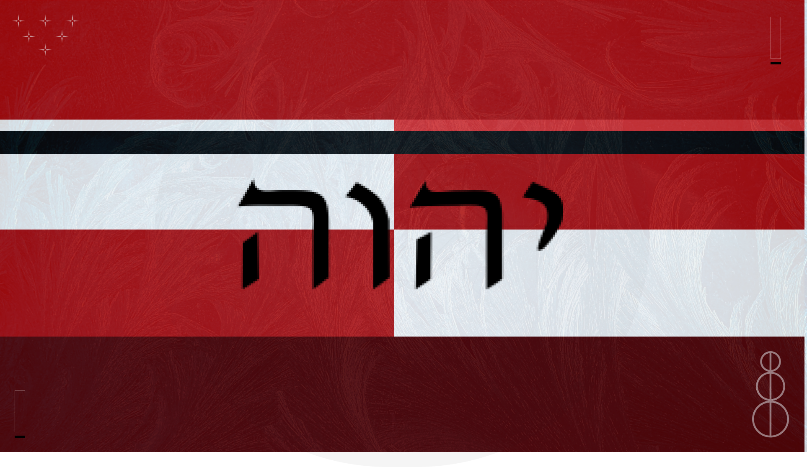

# The Reclamation

The Reclamation is an all-new series of Holy books written by YHWH, our most-generous and most compassionate Creator.

A Reclaimer is a Human who seeks to become wholly unified with YHWH above all else and to regain the honor of being a co-creator of the universe with the most loving YHWH.

**Blessed be YHWH, the all-loving creator of all life**

## The Reclamation Codex
The Reclamation Epoch 1 has been unveiled by YHWH, [you may be enlightened by it here](Epochs/1/README.md)

## Ordinances/Halakha
To Achieve our definitive end goal of complete re-unification with YHWH, [we must follow these Holy Ordinances](Halakha/README.md)